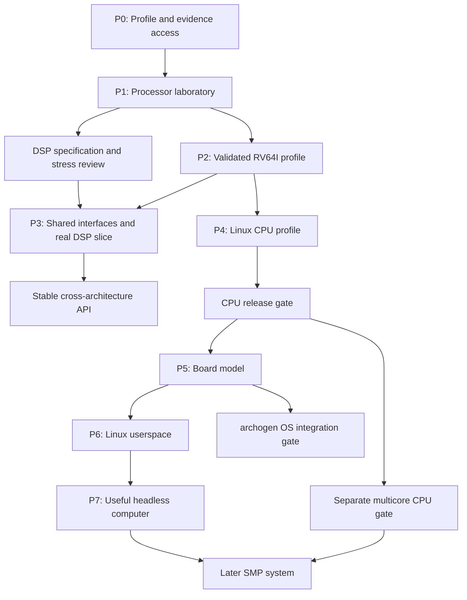

# CPU/DSP Modeling Roadmap v0.2

Date: 2026-09-13  
Working name: **Semulith**  
Status: reviewed design proposal; no CPU implementation or conformance result is claimed.  
Supersedes: roadmap v0.1 as the current plan; preserves v0.1 as historical material.

## 1. Direction and decisions

**Build trustworthy CPU and DSP software models in Rust, then compose validated processor profiles into boards and complete computers capable of running Linux.** All Rust implementation is AI-assisted.

Every model carries a **dual mandate** added `2026-09-14`: it must be signoff, production-grade work **and** serve as educational material from which a student can learn to build production-grade CPU/DSP models capable of running real compiled code (C, Rust, …). These are one artifact with two mandates — the per-model mdBook is the teaching text, the profile and its evidence are the production artifact it teaches from. See [`docs/decisions/decision_dual-mandate-production-and-teaching.md`](docs/decisions/decision_dual-mandate-production-and-teaching.md); it also records what "runs real code" demands of a materials list that the ISA chapters do not own.

Semulith also has a concrete system-modeling consumer: **archogen**, the user's project that generates specific-purpose operating systems from its eADL source of truth. Semulith will execute and help validate those OSes against explicit platform contracts. Linux remains a general-purpose integration workload and the software-computer north star; an archogen OS can be an earlier, smaller system workload.

The first deliverable is the processor: an executable definition, a reference interpreter, and reproducible evidence for a precise supported profile. Board implementation follows validation of the processor profile it will use. A controlled memory/event harness is part of processor testing, not a premature board implementation.

Processor breadth and the software computer are successive deliverables. Evidence tooling supports both; it does not become an unrelated research product. Exact physical timing, every architecture, and a graphical desktop are not prerequisites for the first CPU release.

| Decision | v0.2 choice | Revisit condition |
|---|---|---|
| First CPU | Small **RV64I** profile in a specified laboratory execution environment | Align width/features with archogen's named first target at P0 if that makes another choice more useful |
| RV32 detour | Not required; validate scalar machinery directly at 64 bits | A real RV32 deliverable is requested |
| Semantic authority | One versioned canonical executable definition per processor, with source provenance | Representation may evolve; authority must remain singular |
| Initial representation | Structured encoding/state/profile data plus typed Rust semantic functions | Add a semantic IR/importer when exercised targets demonstrate a benefit |
| Initial backend | Readable Rust interpreter with efficient target-specific state | Optimize only with equivalent evidence and measured need |
| DSP strategy | Real-spec interface review, synthetic stress cases, then a bounded real DSP slice | Oracle/evidence availability determines the real target; no automatic postponement until Linux |
| Reference strategy | Configured Sail and Spike candidates; ACT4 external tests; provenance recorded per subsystem | Actual smoke tests or coverage reveal unsuitable references |
| Production numeric code | Rust; external C/C++ tools may be development-time references | An explicit architecture decision is required for production FFI |
| First Linux system | Single-core console Linux reaching userspace and executing a program | Later headless networking/storage and optional desktop releases |
| archogen integration | Realize eADL HW contracts through engine-selected Semulith models; validate the resolved platform and OS requirements | Inspect the actual eADL typed representation before fixing the adapter |
| Multicore | Separate CPU extension and validation milestone | It never arrives merely by adding host threads |
| Public name | Semulith is proposed, not reserved | Namespace screening before publication or a preferred user name |

These choices make the first task actionable while leaving specification-dependent parameters to P0. Selecting RV64I is not a claim that the laboratory already constitutes a fully specified privileged processor.

## 2. What changed after review

- Split short normative rules from explanation and detailed contracts.
- Added one canonical executable authority per processor and a generated-artifact ownership map.
- Made requirement, implementation, test, dependency, and evidence links machine-readable from P1.
- Defined repeatable gates, conservative change-impact selection, full release validation, and evidence invalidation.
- Specified CPU/environment assumptions and guarantees as a separate versioned contract.
- Required actual reference smoke tests and an independence inventory before committing to a target's validation claims.
- Added early performance constraints, explicit numeric-backend selection criteria, and a separate multicore path.
- Retained DSP architectural pressure early, without making a large unverified DSP implementation mandatory.
- Corrected the review's conflation of finite differential testing with proof and of multiple tools with independent semantic references.
- Added a risk register, glossary, schema starters, initial task cards, and a disposition for M1–M19.

The complete information catalog remains 24 categories. This revision reorganizes and operationalizes it rather than discarding its scope.

## 3. Reading and ownership

| File in the package | Purpose |
|---|---|
| `RULES.md` | Short normative engineering rules with stable IDs |
| `docs/ARCHITECTURE.md` | Canonical definition, generated outputs, runtime boundaries, Rust layout |
| `docs/CPU_ENVIRONMENT.md` | Processor/environment assumptions, guarantees, time, events, and tests |
| `docs/ARCHOGEN_INTEGRATION.md` | eADL ownership, platform contracts, OS test automation, and integration gates |
| `docs/EVIDENCE_AND_GATES.md` | Schemas, traceability, reference independence, change impact, acceptance gates |
| `docs/INFORMATION_CATALOG.md` | The retained 24-category catalog and DSP questions |
| `docs/IMPLEMENTATION_GUIDE.md` | AI-assisted workflow, role ownership, and first task cards |
| `docs/RISKS_AND_DECISIONS.md` | Risk triggers, responses, and decisions due before specific milestones |
| `docs/REVIEW_DISPOSITION.md` | Accepted, adapted, and rejected review recommendations |
| `docs/SOURCES_AND_NAMING.md` | Dated references, dependency boundaries, and name screening |
| `docs/GLOSSARY.md` | Shared meanings of profile, validated, proved, locked, gate, and oracle |
| `schemas/` and `examples/` | Machine-readable starter schemas and clearly synthetic examples |

`RULES.md` governs implementation discipline; the selected profile, environment contract, and pinned external specifications govern target semantics. A contradiction is recorded and resolved explicitly. This roadmap explains milestones; it does not silently override a source rule or a selected profile.

This is a planning package, not an implemented framework. Its schemas establish a starting data contract; cross-record validation and Rust tooling are P1 deliverables.

## 4. A single source of truth, with independent evidence

Each processor has one canonical definition containing its encodings, state, executable semantics, configuration constraints, and provenance. Files may be modular, but a semantic rule has one owned implementation. Generated artifacts carry the canonical-definition and generator fingerprints and are not edited directly.

Decoders, execution backends, disassemblers, documentation, and coverage obligations can derive from that definition. Generation is incremental: not every output is implemented at the first milestone.

Manufacturer specifications remain the external authority. Our executable definition is a reviewed interpretation. Independent reference models, hardware observations, and independently justified expected results remain separate evidence. Generated tests are useful but cannot validate their own underlying interpretation by agreement alone. See rules OWN-01–OWN-05 and EVD-01–EVD-05.

Later devices and boards receive their own canonical definitions, and board profiles select exact processor and device versions. There is no giant universal file containing every machine.

For archogen, **eADL owns descriptions of hardware and OS functionality, required behavior, and constraints; it contains no implementation**. archogen's engine resolves realizations and generates the OS and simulator composition. Semulith supplies canonical executable hardware models on the engine side. A versioned adapter binds the resolved platform to those models, and capability exports allow compatibility checks. Shared facts have one owner and are imported or generated downstream. Independent checks still challenge shared-description mistakes. See `docs/ARCHOGEN_INTEGRATION.md`, aligned with the supplied archogen revision 2.0.

## 5. Correctness and acceptance

The objective is that model observations are permitted by the configured specification, with the progress obligations that specification requires. Observations include state, accesses, exceptions, restart behavior, externally visible ordering, and any declared time/counter behavior.

For deterministic cases, differential tests compare equivalent initial conditions and inputs. Passing finite tests provides evidence for those cases; it does not prove universal trace inclusion. Formal claims identify the checked theorem, assumptions, artifact versions, and bounds. Nondeterministic policies preserve source-defined consistency constraints over time.

Fidelity is reported separately for instruction semantics, system modes, platform coverage, concurrency, timing, implementation compatibility, and evidence. “Supports architecture X” is replaced by an exact profile and capability report.

The processor release gate requires a closed supported scope, resolved environment assumptions, source-linked requirements, independent evidence for the declared risk obligations, successful applicable regression campaigns, replayable reports, and portability checks. The full gate is in `docs/EVIDENCE_AND_GATES.md`; board work cannot substitute a Linux boot for it.

“Locked” means a versioned accepted profile whose evidence is attached to its exact inputs. Semantic fixes invalidate affected evidence and produce a new accepted version after revalidation. It never means errors become unfixable.

## 6. Milestone dependencies

The DSP path gates a stable cross-architecture API claim. It does not require waiting for a complete DSP before extending a validated CPU toward Linux. Shared changes from that path still revalidate every affected CPU profile. The graph describes work dependencies, not an instruction to deploy multiple coding agents.

### P0 — Select and establish the first experiment

Create `rv64i-lab-v0` as a development profile: RV64I semantics, one core, little-endian ordinary memory, explicit entry state, memory boundaries, access/misalignment policy, instruction-fetch rules, and environment-trap reporting. Pin the applicable specification and resolve all choices needed by the selected scope. No privileged-system support is implied.

Acquire reproducible source/model builds or binaries for the chosen reference path. Run at least one actual matched-profile experiment before marking the reference usable. Record tool versions, source/binary hashes, effective configurations, adapters, and known gaps. Establish whether a second comparator shares relevant semantic code.

Deliver a state inventory, requirements catalog seed, environment contract, three representative guest programs, and an evidence-obligation policy. Prototype support may begin with a small declared instruction subset; the accepted P2 profile covers its entire declared scope.

**Gate G0:** foundational semantics are resolved; an actual evidence path works; profile and reference differences are enumerated. Reference acquisition is work with observable outcomes, not an unchecked URL list.

### P1 — Build the processor laboratory

Create three initial Rust crates for core modeling, verification, and CLI control. Implement target arithmetic primitives, state, controlled memory responses, fault/event injection, deterministic stepping, explicit outcome types, and input replay.

Establish one canonical definition, source-linked requirement IDs, annotations/manifests linking code to requirements, tests declaring exercised obligations, and a graph checker. Generate the gate report from pinned inputs. Schema validation alone is not sufficient; referential integrity and dependency checks are required.

Implement a vertical instruction slice with an independently encoded program and first-divergence comparison. Retain a small validator mutation suite that catches known-wrong arithmetic, missed writes, wrong fault classification, and wrongly masked comparisons. Run traced and untraced executions against the same observations.

Measure a baseline workload on a named host with allocation counts and trace settings. Prefer allocation-free scalar execution and no diagnostic formatting in the normal path. Set regression thresholds after repeated measurements characterize noise; do not invent a universal MIPS target.

**Gate G1:** failures are replayable; model limitations differ from target traps; malformed evidence links are rejected; known validator mutations are detected; the measured baseline is recorded.

### P2 — Validate the first RV64I profile

Complete the declared scalar instruction and laboratory-environment scope. Cover source requirements, boundary arithmetic, mode-independent state interactions, fetch/access faults, suppressed effects, reserved cases, and controlled event boundaries where applicable.

Run matched reference comparisons, configured external tests, directed sequence tests, and compiled freestanding programs. Report coverage denominators and retain minimized discrepancies. Demonstrate snapshot/replay only for the state boundaries actually implemented.

**Gate CPU-LAB:** the selected profile passes the full processor gate. This is a useful reusable CPU deliverable, not merely a boot test. Its machinery and relevant scalar requirements transfer to P4; RV64 privilege, translation, atomics, and floating-point evidence remain new work.

### P3 — Exercise breadth and stabilize only what is demonstrated

Use real DSP specifications to review 15–20 discriminating instruction/sequence cases selected for properties actually present in those processors. Add executable synthetic tests for nonstandard widths, distinct address spaces, packets, and delayed effects. Synthetic behavior tests interfaces, not real DSP compatibility.

Select a narrow real DSP slice only after demonstrating its evidence path or publishing a deliberately limited experimental claim. TI C64x/C64x+ is a documentation candidate, not an acquired oracle. Its availability is resolved before promising a compatibility release.

Develop schema/generator functionality where the exercised targets justify it. Keep opaque semantic hooks explicit about contracts, state, and backend support. Preserve regression evidence for the scalar profile.

**Gate BREADTH:** the stated real subset has evidence; the public abstraction supports the exercised cases; unsupported families remain unclaimed. A stable general API requires this gate, while architecture-specific CPU progress may continue before it.

### P4 — Validate the processor needed for Linux

Select a Linux-capable profile, provisionally RV64GC with explicitly chosen privilege revision, M/S/U modes, Sv39 translation, implemented CSRs, interrupt acceptance, counter behavior, and firmware/toolchain requirements. Resolve exact dependencies before claiming this profile.

Implement and independently test its system transitions, page walks and permitted side effects, protection, atomics, floating point, instruction visibility, faults, and restart obligations using the laboratory environment. Floating-point backend selection must pass its own source/configuration and numeric qualification task before inclusion.

**Gate CPU-SYSTEM:** the complete declared profile passes the processor gate, including its environment contract. This gate authorizes the planned next engineering stage: board implementation. It does not require a new user permission ceremony.

### P5 — Model one board in Rust

Specify a minimal virtual platform with documented memory, reset, timers, interrupt controllers, and serial console. Give each device a dossier, requirement/evidence links, and state/reset/access tests. Demonstrate that the board fulfills every assumption in the accepted CPU contract.

Generate consistent address maps, wiring, and hardware-description data from the canonical board definition. Keep independently sourced device expected results and firmware probes. Model mismatches become CPU, contract, device, or composition issues with explicit ownership.

**Gate BOARD:** devices and composition pass their applicable gates; small firmware probes pass; no silently incompatible CPU/environment assumption remains.

At this point, a compatible archogen-generated OS may enter its own integration gate without waiting for Linux or the full computer. Its required CPU profile must already have passed its CPU gate; if it needs fewer CPU features than P4, a separately accepted smaller profile can support an earlier board branch under the same rule. Contract design starts now; board execution still follows CPU validation.

### P6 — Boot Linux to useful userspace

Pin firmware, Linux, build configuration, hardware description, and initramfs. The default RISC-V route executes compatible M-mode firmware providing selected SBI services before entering an S-mode kernel; a host-modeled SBI is a different contract and is not silently substituted.

**Gate LINUX:** reproducible cold boot reaches userspace `init` and a console shell, runs a guest program, exercises timer-driven scheduling, and completes a documented shutdown or reboot path. A kernel banner alone is insufficient. CPU bugs discovered here return to CPU regressions and invalidate affected evidence.

Linux's actual entry-state and placement requirements are a separate system contract. See [Linux RISC-V boot documentation](https://docs.kernel.org/arch/riscv/boot.html).

### P7 — Deliver a useful headless computer

Add persistent block storage, file workloads, networking, reset/reboot, and system snapshots in individually specified increments. Each included feature has reproducible guest workloads and device evidence.

**Gate SYSTEM:** the declared headless workload suite passes, storage persists correctly, and snapshot/restore preserves relevant CPU/device/event state. This is the first bounded full-computer release.

Graphics, keyboard/pointer input, and a desktop are a subsequent product increment with an explicit device list and performance budget, preserving the long-term personal-computer ambition without hiding its work inside P7.

### Separate multicore and optimization work

Multicore first extends and revalidates the CPU/environment memory model, atomicity, reservations, event delivery, and progress. A deterministic sequentially consistent execution mode is a legitimate initial design if its produced executions satisfy the selected architecture; it does not explore all weaker outcomes. SMP Linux is a later integration test.

Broader weak-memory exploration uses a separately selected existing operational or axiomatic checker and a pinned litmus corpus. Do not build a research-grade memory-model checker as an incidental emulator feature.

Profile-guided optimization and JIT work retain the reference interpreter and observational-equivalence regression path. Measured performance limitations may justify earlier optimization, but never skipped CPU gates or altered semantics.

## 7. First tasks and revision boundary

The first tasks are: establish profile and sources; demonstrate reference access; specify the environment boundary; implement the canonical model skeleton; build the graph/evidence checker; execute the first independent fixture; validate the validator; complete the scalar profile.

Detailed task cards are in `docs/IMPLEMENTATION_GUIDE.md`. Task completion records actual commands, artifacts, and results; AI agreement or generated lines of code do not count as evidence.

v0.3 should incorporate outcomes from the profile/reference experiment, concrete state/effect API examples, and qualified dependency choices. No arbitrary elapsed-time estimate is attached before those facts exist. The roadmap versions are independent of CPU release versions.

## 8. Naming

**Semulith** is the recommended working name: a coined name suggesting semantics and emulation, with room for processor, board, and system models. Proposed CLI: `semulith`; initial crate names: `semulith-core`, `semulith-verify`, and `semulith-cli`.

A preliminary indexed search found no obvious exact software-project collision, but the registry lookup did not establish availability. No crate, repository, domain, or trademark has been reserved or cleared. The engineering plan does not depend on the name being final.
