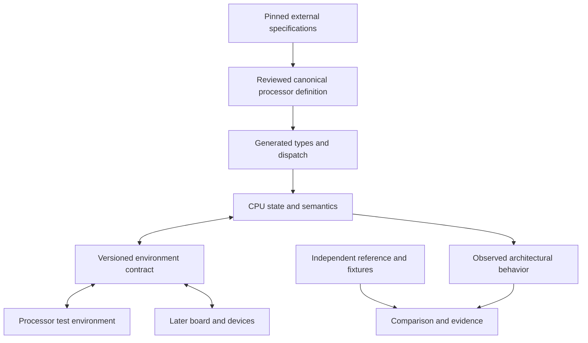

# Architecture and canonical definitions — v0.2

## 1. Logical authority, modular files

The canonical processor definition is a versioned package. Its initial layout is:

| Owned input | Content | Owner |
|---|---|---|
| `model.toml` | Model identity, definition version, file manifest, supported generator capabilities | Processor definition |
| `encodings.json` | Encoding fields, decode context, validity predicates, semantic handler bindings | Processor definition |
| `state.json` | Register/state descriptors, widths, aliases, reset constraints | Processor definition |
| `semantics/*.rs` | Typed executable operations, effects, exceptional behavior, progress rules | Processor definition |
| `profiles/*.toml` | Features, configuration constraints, implemented scope, selected choices | Processor definition |
| `sources.toml` | Applicable specification revisions and precise source locators | Processor dossier |
| `requirements.jsonl` | Traceable statements of obligations and evidence policy | Verification dossier |
| `environment/*.toml` | Versioned assumptions/guarantees and their test obligations | CPU/environment contract |

This is a proposed repository layout. Only the planning schemas/examples in this package exist now. File formats may evolve — and have: §1.1–§1.3 describe the format the canonical definition actually uses today, the fragment and its composition operator, and the schema layer that turns "it parses" into validation. OWN-01 remains: one executable owner for each semantic rule.

### 1.1 One format: every engine input is an S-expression

The table above is the v0.2 proposal, and its per-file formats — JSON for encodings, Rust
sources for semantics, TOML for profiles — have been superseded by one decision (director,
2026-09-14, `decision_one-format-every-source-of-truth`): **every source of truth the generator
engine reads is one format, S-expression data**. The reason is composition, not tidiness: a
board that composes two processors must merge their definitions, requirements, obligations and
pinned sources, and a merge is only definable when both sides are the same kind of thing — three
formats would be three merge semantics.

What exists in that format today:

- `definitions/` holds reusable fragments (§1.2), and a profile composes them with its own
  `encoding.sexp`. All of it parses with the project's reader `scripts/sexp.py` and with the
  LinkedSpec Rust route (`specs/Lispish.spec` on the vendored submodule — no S-expression parser
  is hand-written in this project's crates). The two readers are compared mechanically on every
  tracked `.sexp` file by `scripts/compare_readers.py`, which reports agreement file by file and
  refuses an unbuilt or disagreeing reader rather than counting it as agreeing; the comparison
  classifies the two documented reader-contract differences (quoted-numeric typing, escape
  retention) instead of mistaking them for agreement or for defects.
- **Semantics are data, cited.** `definitions/riscv/rv64i.sem.sexp` expresses each instruction's
  semantics in the same format, every rule carrying a citation into the pinned specification
  snapshot; `scripts/check_semantics.py` reports 52 of 52 declared instructions with checked
  semantics — well-formed, complete and cited. *Cited is not verified*: correctness against the
  specification is a differential experiment against an independent reference (P1/P2). This does
  not change §2's generation boundary — the execution backend is still generated dispatch over
  canonical handlers; the data is the definition those handlers derive from.
- The profile **records** are in the format now: `requirements.sexp` (26) and
  `contract-obligations.sexp` (34), converted by `SOT-FORMAT.3` behind the schema layer (§1.3),
  with the round-trip against the retired JSONL proven byte-identical, not asserted. The
  remaining **configuration** inputs moved with `SOT-FORMAT.4`: `profile.sexp` (the
  `[profile]`/`[state]`/`[scope]` tables and all 26 `[[decision]]` records), `state.sexp`,
  `sources.sexp`, `references.sexp`, the matched-profile override `reference/sail-rv64i-lab-v0.
  override.sexp`, and the guest expectations `guests/*.expected.sexp` are all one document form
  each, validated against six schemas, with the round-trip against the retired TOML/JSON proven
  field-for-field and the files' commentary surviving as first-class `(comment "…")` forms —
  the format's reserved annotation head, never dropped. The one foreign-tool input — the Sail
  model reads JSON — is derived from its `.sexp` on every run (`target/refs/…override.json`,
  byte-identical to the tracked original), so the `.sexp` stays the single source of truth.

### 1.2 Fragments, and the composition operator

A **fragment** is a complete, independently checkable description of one thing — one ISA base,
one extension, one semantics set. It lives in `definitions/` rather than inside a profile
because a base ISA is shared by every profile that composes it; copying it per profile would be
the duplication composition exists to avoid. Each fragment declares its `id`, its `kind`, the
fragments it `requires` — the M extension requires the base because it reuses the base's operand
fields and defines none of its own; a fragment with a hidden dependency is a fragment that
composes by luck — and the pinned `source` files it was generated from. Fragments are generated
by `scripts/gen_fragments.py` from pinned upstream tables and are changed by regeneration, not
by hand.

**Composition** is the operator that makes a unit from fragments: a unit's encoding space is the
union of its fragments' encoding spaces, and the union is decided, not hoped.
`scripts/check_encoding_disjoint.py` refuses any word that two instructions both claim, so a
profile that composes an extension overlapping its base fails loudly. Encoding composition is
decidable and checked today (`MODEL-COMPOSE.1`/`.2`); the records compose the same way
(`SOT-FORMAT.5`): `scripts/merge_records.py` unions two units' requirements, obligations and
pinned sources by id — same id must mean the same content, a source id must pin the same bytes,
and every dependency, obligation link and citation must resolve across the union or the
composition is refused with the conflicting fact named. And the composition claim is
conditional no longer in name only: `scripts/discharge_assumptions.py` is the mechanical form
of `docs/CPU_ENVIRONMENT.md` §5 — every `environment-assumption` must be discharged by a named
guarantee in the merged unit, or the composition is rejected naming it (`MODEL-COMPOSE.3`; the
profile's own 8 assumptions discharge 8/8 today).

### 1.3 The schema layer

An S-expression reader accepts anything syntactically, so "it parses" is not validation. The
schema layer declares every construct — its head, its fields, their arity and value types,
whether they repeat — as data in `schema/`, and refuses an undeclared construct, an unknown
field, a wrong arity or a wrong value type **by name**, never silently. Adding a domain
construct — a register file, a memory map, a peripheral — then requires a schema file and zero
lines of reader code. The schema language is written in itself, and its own description
validating under itself is the fixpoint that proves extensibility rather than asserting it
(`scripts/check_sexp_schema.py <file.sexp> <schema.sexp>`; `schema/schema.sexp` is the language
in itself).

Built today: the language (`schema/schema.sexp`, four declaration kinds — `(schema …)`,
`(construct …)`, `(field …)`, and `(operator …)` for positional mini-languages the record
grammar cannot state, such as the fragment files' `(fixed (31 25 0x0) …)` triples and the
semantics effect expressions; field declarations since `SOT-FORMAT.3` also carry optional
facets — `(pattern …)`, `(min-length N)`, `(min N)`, `(unique yes)` — the record contracts
demanded and the layer now states as data), plus one schema per corpus family — `encoding.sexp`,
`fragment.sexp`, `semantics.sexp`, `requirements.sexp`, `contract-obligations.sexp` and, since
`SOT-FORMAT.4`, `profile.sexp`, `state.sexp`, `sources.sexp`, `references.sexp`,
`override.sexp`, `expectations.sexp` — under which the tracked corpus validates; the semantics'
32-form language is data there, and `scripts/check_semantics.py` loads it. The profile's
requirement and obligation catalogues are in the format behind this layer (`SOT-FORMAT.3`), and
its whole dossier with them (`.4`), each family read through the single mapping owner —
`scripts/records_sexp.py` for the catalogues, `scripts/dossier_sexp.py` for the dossier — so the
correspondence lives in exactly one place per family; the frozen `examples/` JSONL stay JSONL on
purpose, still validated by the tracked JSON-schema validator. The layer deliberately never reads
a second file: checks that need two sources of truth (operand scoping against the encoding,
coverage of the declared instructions, citation against a profile's pinned sources) live in the
consumers. Configuration, state and provenance converted behind this layer at `.4`; records learn
to merge across a composition boundary at `.5`, and the `SOURCE-FORMAT` gate that refuses any
source outside the format lands at `.6`; until then, `check_semantics.py`/
`check_encoding_disjoint.py` keep checking what they already checked.

These executable definitions belong on the engine/model side of the archogen boundary. They are not implementation syntax to add to eADL. eADL may describe the offered hardware contracts; a versioned adapter connects archogen's resolved implementation plan to Semulith models and composition.

Requirements record what needs to be true and why. They are not an alternative executable instruction implementation. An independent reference is intentionally a separate interpretation used to challenge the canonical model, not a competing production authority.

## 2. Generation boundaries

| Artifact | Derivation | Independence/maintenance rule |
|---|---|---|
| Decoder and decoded-operation types | Encoding/context/validity definitions | Generated; do not maintain a second handwritten table |
| State accessors and inspection metadata | State/alias definitions | Generated checks plus target-specific operations where required |
| Reference interpreter | Generated dispatch plus canonical Rust semantic functions | The functions own behavior; this backend is not an external oracle |
| Disassembler/encoder | Shared encoding fields with explicit syntax metadata | Round-trip agreement is structural evidence, not independent ISA validation |
| Semantic documentation | Canonical descriptors, source-linked handlers, later rendered semantic IR | Handwritten explanation is labeled rationale and reviewed for drift |
| Requirement coverage skeleton | Requirement catalog and declared obligations | Generated skeleton does not invent test results or test adequacy |
| Generated tests | Encoding/semantic constraints | Useful for integration, coverage, and mutation; keep independent expected cases |
| JIT or other optimized backend | Later supported semantic lowering | Preserve defined effects and compare against retained reference plus external evidence |
| Board maps and hardware description | Canonical board composition | Device behavior remains owned by the device definition |
| Platform capability manifest for archogen | Accepted processor/device/board profile and explicit boot contract | Read-only derived view; eADL imports or selects facts without becoming a second hardware implementation |
| Golden results/reference traces | Independent reference, manual derivation, hardware, or proof artifact | Never automatically rewritten from DUT output |

A generated interpreter does not require that every semantic statement already lives in a DSL. Initially the compiler and generated dispatch execute canonical Rust handlers. A later semantic IR becomes the canonical semantic representation only through an explicit migration; the superseded production representation then becomes derived or is removed. Retaining it as an independent comparison implementation requires clear ownership and separate maintenance status.

Generated outputs embed a manifest of definition, generator, configuration, and source fingerprints. CI regenerates and detects drift. An importer also records input dialect and translation coverage; an unsupported construct is a model-generation failure, not a guessed translation.

## 3. Runtime boundary

LAB and BOARD are alternative providers. The laboratory supplies controlled memory, faults, counter samples, and input events; a board supplies corresponding real modeled device behavior after the CPU gate. The observation layer can be a no-op diagnostic observer without removing semantic effects.

## 4. Rust ownership map

| Component/module | Initial crate | Dependency rule |
|---|---|---|
| Profiles, typed values, generated state, decode/semantics | `semulith-core` | No dependency on CLI or verification harness |
| Environment request/response contract types | `semulith-core` | Describes boundary, does not implement board devices |
| Execution control, progress and stop types | `semulith-core` | Guest time and event ordering are explicit |
| Controlled memory and event fixtures | `semulith-verify` | Implements core boundary for tests |
| Source/evidence graph, adapters, comparators, reducer | `semulith-verify` | Does not supply production instruction semantics |
| User commands and report presentation | `semulith-cli` | Calls core/verification APIs without duplicating behavior |
| Definition generation | Initially build/development module with deterministic outputs | Separate crate only when its scope warrants it |
| Later board/device implementations | Later system crate(s) | Consume versioned core types; no dependency on test-only fixtures |

The task boundary is architectural behavior, not arbitrary crate count. Concrete target state and common arithmetic use native fixed-width values. A nonstandard width can use masked fixed-width storage when it fits; genuinely larger values use an appropriate fallback. Arbitrary width does not imply allocating for every operation.

## 5. Effects, errors, and progress

Use separate typed families for:

- `TargetEvent`: an architectural trap/exception, completed access, or other guest event.
- `Advance`: completed or partial execution progress, waiting, or a requested control stop.
- `ModelError`: missing model behavior, invalid description/configuration, inconsistent internal state, or harness contract violation.
- `UndefinedCase`: a source-classified case handled by the selected diagnostic/exploration policy, not automatically converted into a guest exception.

A target exception may be delivered to a modeled handler and execution continue; it is not synonymous with stopping the emulator. Precise enum shapes are a P1 design result. Constructors and tests help enforce classification, but types alone cannot prove that a developer chose the correct variant.

The execution unit can be an instruction, packet, or restartable suboperation. Required pending effects are model state. Operand snapshots, forwarding, fault priority, partial commits, and restart locations follow the processor definition. Disabling diagnostics must not remove them.

## 6. Performance choices and numeric qualification

Prefer fixed-width scalar storage, generated dispatch, reusable buffers, and no mandatory heap allocation or string formatting in the common execution path. A generic observer with a no-op implementation is a useful design; inspect generated code or measured behavior rather than assuming it is free. Trait objects are not universally forbidden; choose static/dynamic dispatch using measured cost and extensibility needs.

Keep separate benchmark modes for untraced execution, instrumented comparison, and diagnostic tracing. Measure arithmetic, control flow, memory, and fault-heavy mixes separately, along with allocation counts. Small early benchmarks establish regressions, not predicted Linux boot speed.

The numeric interface represents rounding mode, flags, result bits, conversions, and target NaN/boxing rules explicitly. Before production floating-point support, qualify a named Rust implementation against these semantics and independent evidence. Capture shared SoftFloat ancestry, target specialization, thread-local/global status handling, and exact compiler/features. If no suitable Rust implementation passes, implement the required subset in Rust and defer the corresponding CPU capability until validated; no silent native-float or FFI fallback.

TestFloat ordinarily obtains DUT expected values from SoftFloat, so a direct SoftFloat comparison is not automatically another independent numerical engine. See [TestFloat](https://www.jhauser.us/arithmetic/TestFloat.html) and [SoftFloat specializations](https://www.jhauser.us/arithmetic/SoftFloat-3/doc/SoftFloat-source.html).

## 7. Replay, configuration, and snapshots

Capture the effective configuration after defaults and overrides, not merely the supplied fragment. Identity includes code and generator versions, compile features, numeric specialization, initial state, guest image, environment policy, reference adapters, external events, and relevant nondeterministic choices.

Replay may initially restart from an initial fixture. A mid-execution snapshot must additionally capture all future-relevant pending state and validate compatibility. A seed without the generator version and event stream is insufficient.
