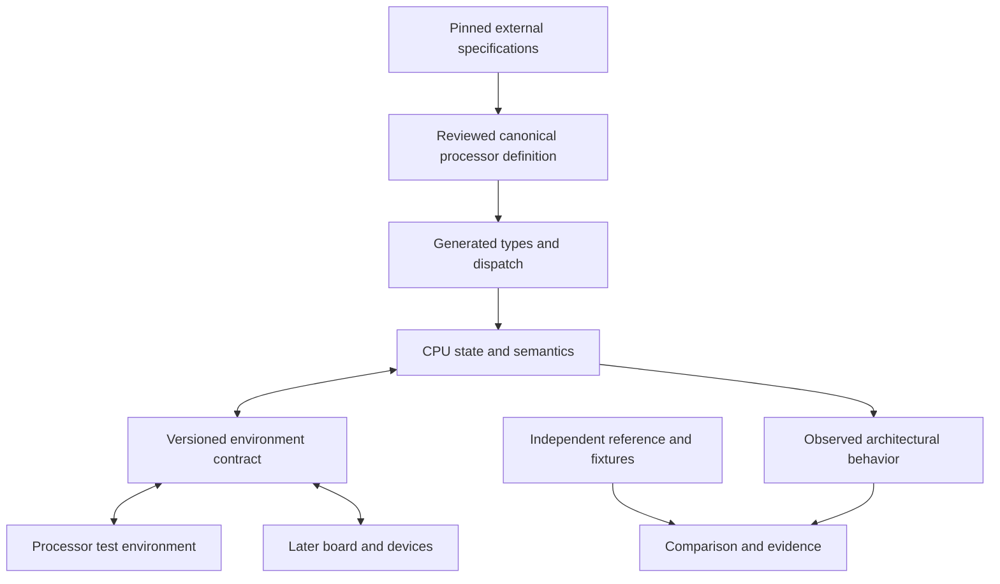

# Architecture and canonical definitions — v0.2

## 1. Logical authority, modular files

The canonical processor definition is a versioned package. Its initial layout is:

| Owned input | Content | Owner |
|---|---|---|
| `model.toml` | Model identity, definition version, file manifest, supported generator capabilities | Processor definition |
| `encodings.json` | Encoding fields, decode context, validity predicates, semantic handler bindings | Processor definition |
| `state.json` | Register/state descriptors, widths, aliases, reset constraints | Processor definition |
| `semantics/*.rs` | Typed executable operations, effects, exceptional behavior, progress rules | Processor definition |
| `profiles/*.toml` | Features, configuration constraints, implemented scope, selected choices | Processor definition |
| `sources.toml` | Applicable specification revisions and precise source locators | Processor dossier |
| `requirements.jsonl` | Traceable statements of obligations and evidence policy | Verification dossier |
| `environment/*.toml` | Versioned assumptions/guarantees and their test obligations | CPU/environment contract |

This is a proposed repository layout. Only the planning schemas/examples in this package exist now. File formats may evolve, but OWN-01 remains: one executable owner for each semantic rule.

These executable definitions belong on the engine/model side of the archogen boundary. They are not implementation syntax to add to eADL. eADL may describe the offered hardware contracts; a versioned adapter connects archogen's resolved implementation plan to Semulith models and composition.

Requirements record what needs to be true and why. They are not an alternative executable instruction implementation. An independent reference is intentionally a separate interpretation used to challenge the canonical model, not a competing production authority.

## 2. Generation boundaries

| Artifact | Derivation | Independence/maintenance rule |
|---|---|---|
| Decoder and decoded-operation types | Encoding/context/validity definitions | Generated; do not maintain a second handwritten table |
| State accessors and inspection metadata | State/alias definitions | Generated checks plus target-specific operations where required |
| Reference interpreter | Generated dispatch plus canonical Rust semantic functions | The functions own behavior; this backend is not an external oracle |
| Disassembler/encoder | Shared encoding fields with explicit syntax metadata | Round-trip agreement is structural evidence, not independent ISA validation |
| Semantic documentation | Canonical descriptors, source-linked handlers, later rendered semantic IR | Handwritten explanation is labeled rationale and reviewed for drift |
| Requirement coverage skeleton | Requirement catalog and declared obligations | Generated skeleton does not invent test results or test adequacy |
| Generated tests | Encoding/semantic constraints | Useful for integration, coverage, and mutation; keep independent expected cases |
| JIT or other optimized backend | Later supported semantic lowering | Preserve defined effects and compare against retained reference plus external evidence |
| Board maps and hardware description | Canonical board composition | Device behavior remains owned by the device definition |
| Platform capability manifest for archogen | Accepted processor/device/board profile and explicit boot contract | Read-only derived view; eADL imports or selects facts without becoming a second hardware implementation |
| Golden results/reference traces | Independent reference, manual derivation, hardware, or proof artifact | Never automatically rewritten from DUT output |

A generated interpreter does not require that every semantic statement already lives in a DSL. Initially the compiler and generated dispatch execute canonical Rust handlers. A later semantic IR becomes the canonical semantic representation only through an explicit migration; the superseded production representation then becomes derived or is removed. Retaining it as an independent comparison implementation requires clear ownership and separate maintenance status.

Generated outputs embed a manifest of definition, generator, configuration, and source fingerprints. CI regenerates and detects drift. An importer also records input dialect and translation coverage; an unsupported construct is a model-generation failure, not a guessed translation.

## 3. Runtime boundary

LAB and BOARD are alternative providers. The laboratory supplies controlled memory, faults, counter samples, and input events; a board supplies corresponding real modeled device behavior after the CPU gate. The observation layer can be a no-op diagnostic observer without removing semantic effects.

## 4. Rust ownership map

| Component/module | Initial crate | Dependency rule |
|---|---|---|
| Profiles, typed values, generated state, decode/semantics | `semulith-core` | No dependency on CLI or verification harness |
| Environment request/response contract types | `semulith-core` | Describes boundary, does not implement board devices |
| Execution control, progress and stop types | `semulith-core` | Guest time and event ordering are explicit |
| Controlled memory and event fixtures | `semulith-verify` | Implements core boundary for tests |
| Source/evidence graph, adapters, comparators, reducer | `semulith-verify` | Does not supply production instruction semantics |
| User commands and report presentation | `semulith-cli` | Calls core/verification APIs without duplicating behavior |
| Definition generation | Initially build/development module with deterministic outputs | Separate crate only when its scope warrants it |
| Later board/device implementations | Later system crate(s) | Consume versioned core types; no dependency on test-only fixtures |

The task boundary is architectural behavior, not arbitrary crate count. Concrete target state and common arithmetic use native fixed-width values. A nonstandard width can use masked fixed-width storage when it fits; genuinely larger values use an appropriate fallback. Arbitrary width does not imply allocating for every operation.

## 5. Effects, errors, and progress

Use separate typed families for:

- `TargetEvent`: an architectural trap/exception, completed access, or other guest event.
- `Advance`: completed or partial execution progress, waiting, or a requested control stop.
- `ModelError`: missing model behavior, invalid description/configuration, inconsistent internal state, or harness contract violation.
- `UndefinedCase`: a source-classified case handled by the selected diagnostic/exploration policy, not automatically converted into a guest exception.

A target exception may be delivered to a modeled handler and execution continue; it is not synonymous with stopping the emulator. Precise enum shapes are a P1 design result. Constructors and tests help enforce classification, but types alone cannot prove that a developer chose the correct variant.

The execution unit can be an instruction, packet, or restartable suboperation. Required pending effects are model state. Operand snapshots, forwarding, fault priority, partial commits, and restart locations follow the processor definition. Disabling diagnostics must not remove them.

## 6. Performance choices and numeric qualification

Prefer fixed-width scalar storage, generated dispatch, reusable buffers, and no mandatory heap allocation or string formatting in the common execution path. A generic observer with a no-op implementation is a useful design; inspect generated code or measured behavior rather than assuming it is free. Trait objects are not universally forbidden; choose static/dynamic dispatch using measured cost and extensibility needs.

Keep separate benchmark modes for untraced execution, instrumented comparison, and diagnostic tracing. Measure arithmetic, control flow, memory, and fault-heavy mixes separately, along with allocation counts. Small early benchmarks establish regressions, not predicted Linux boot speed.

The numeric interface represents rounding mode, flags, result bits, conversions, and target NaN/boxing rules explicitly. Before production floating-point support, qualify a named Rust implementation against these semantics and independent evidence. Capture shared SoftFloat ancestry, target specialization, thread-local/global status handling, and exact compiler/features. If no suitable Rust implementation passes, implement the required subset in Rust and defer the corresponding CPU capability until validated; no silent native-float or FFI fallback.

TestFloat ordinarily obtains DUT expected values from SoftFloat, so a direct SoftFloat comparison is not automatically another independent numerical engine. See [TestFloat](https://www.jhauser.us/arithmetic/TestFloat.html) and [SoftFloat specializations](https://www.jhauser.us/arithmetic/SoftFloat-3/doc/SoftFloat-source.html).

## 7. Replay, configuration, and snapshots

Capture the effective configuration after defaults and overrides, not merely the supplied fragment. Identity includes code and generator versions, compile features, numeric specialization, initial state, guest image, environment policy, reference adapters, external events, and relevant nondeterministic choices.

Replay may initially restart from an initial fixture. A mid-execution snapshot must additionally capture all future-relevant pending state and validate compatibility. A seed without the generator version and event stream is insufficient.
