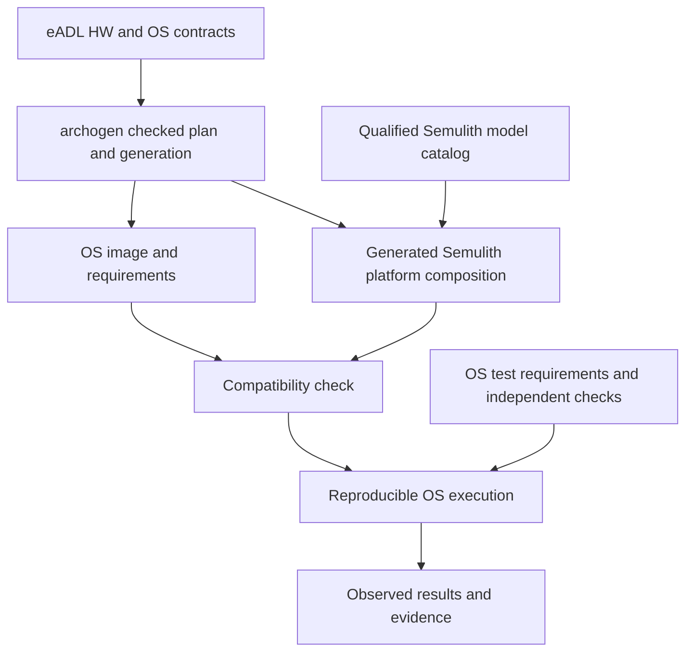

# archogen and Semulith — v0.2

## 1. Product relationship

archogen generates specific-purpose operating systems from eADL, its source of truth. Semulith provides modeled processors and, after their validation, system platforms on which those OSes can run and be tested. This section incorporates the supplied `os-generation-roadmap-revised-v2.md`, revision 2.0 dated 2026-09-13, especially §§3–6, 12–15. Its roadmap was inspected; no eADL grammar, typed API, or archogen implementation was supplied. The original archogen roadmap is unchanged.

An archogen OS is a first-class future workload. It can be smaller than Linux and need fewer devices or processor features. Linux remains valuable as an independently developed, demanding integration workload and a step toward a complete software computer.

## 2. Source ownership

| Information | Canonical owner | Consumer |
|---|---|---|
| HW and OS features, externally required/offered behavior, workload, and constraints | eADL descriptions and versioned functional semantics; no implementation | archogen elaboration, resolution, and independent configuration checker |
| OS algorithms, provider selection, lowering, code generation, and build inputs | archogen engine, catalogs, and separate application/build manifest | Generated OS and simulator composition |
| Modeled CPU and device behavior | Semulith's source-linked executable definitions | Semulith execution backends and validation |
| Selected resources, addresses, wiring, and model bindings for an archogen-generated platform | Checked engine realization plan derived from eADL constraints and pinned platform knowledge | Generated Semulith composition/configuration and OS target artifacts |
| Standalone Semulith platform configuration | Canonical Semulith board profile, importing shared platform facts where applicable | Standalone runner and offered-capability export |
| What a generated OS needs from a platform | archogen's versioned target requirements | Compatibility checker and Semulith runner |
| Entry conditions and supported firmware interface | Explicit platform boot contract, owned by the selected platform package | OS loader/firmware and archogen startup generation |
| OS correctness requirements and expected outcomes | archogen verification requirements with independently justified checks | OS test runner and evidence report |

One source of truth means logical ownership, not one language or repository. eADL describes both hardware and OS functionality; executable CPU semantics, device transitions, register-programming algorithms, simulator implementations, and provider selection remain engine knowledge. Semulith supplies that hardware-model knowledge and execution capability through versioned APIs. Missing model behavior is an unsupported engine realization, not a request to put implementation into eADL.

The bridge consumes archogen's checked realization plan through a versioned adapter. It selects qualified Semulith CPU/device models and generates their composition, parameters, and wiring. Semulith exports the resulting platform's capabilities so the checker can compare offered behavior with the original eADL requirements and actual chosen providers. Selection must respect joint resources, topology, and ownership; individually matching capabilities are insufficient.

For a standalone Semulith platform, its canonical board profile can instead supply the offered platform description that archogen targets. These are two entry paths with explicit ownership, not a bidirectional synchronization loop. Shared constants and facts are imported or derived from their declared owner; no handwritten duplicate maps. A shared contract/schema improves consistency but can carry a common misconception into both outputs, so independent target/source checks remain necessary.

Do not create a second eADL parser, matcher, scheduler, or OS generator in Semulith. The initial adapter uses archogen's normalized contracts and checked plan once their real interfaces are available. Semulith's core remains usable without archogen. No new universal architecture language is a prerequisite for starting the CPU work.

## 3. Platform contract content

The future versioned manifest should expose information the OS actually needs:

- Exact CPU model/profile, required and offered extensions, address widths, endianness, privilege modes, and memory/atomicity model.
- Available RAM and reserved regions, MMIO map, device identity/revision, access widths, interrupt routing, timers, and boot resources.
- Supported image format, load placement, entry address/state, argument convention, firmware services, and any hardware-description format. The selected toolchain ABI is an explicit integration constraint, not something inferred solely from the CPU ISA.
- Counter/time meaning, event delivery, available scheduling policies, and the declared timing fidelity.
- Test-control capabilities: console capture, completion/failure signals, reset, input/event injection, execution budgets, trace selection, and eventually snapshots.
- Profile/contract versions, dependencies, capability limitations, and fingerprints of the actual selected definitions.

Required versus optional facilities are explicit. Reject unsupported requirements before boot where they can be checked statically; dynamic obligations still need tests. A compatible manifest does not prove an OS is correct or that the manifest matches the implementation.

The platform contract is distinct from the CPU/environment contract: the latter connects CPU execution to memory/events; the former exposes the assembled machine and its boot/test interface to an OS producer.

## 4. Automated OS testing

Each run records the eADL revision, archogen generator and mapping versions, toolchain/configuration, OS image hash, Semulith build/profile, platform contract, test-plan version, and event choices. Results distinguish an OS assertion failure, guest exception, expected shutdown, exhausted execution budget, unsupported model capability, and a Semulith internal failure. OS exceptions are not automatically test failures: the test contract defines the expected outcome.

The runner first supports reproducible boot, console output, and a declared guest completion protocol. Then add interrupt handling, timer-driven progress, protection/isolation, drivers, and restart/recovery tests where the specific OS requires them. OS timing claims need an appropriate timing model; functional execution or instruction counts alone cannot establish physical worst-case execution time.

Generated tests from eADL check consistency and can provide valuable coverage. They cannot alone detect an incorrect eADL interpretation shared by OS and test generators. Pair important OS properties with separately justified assertions, external workloads/reference behavior where applicable, or checked proofs with explicit assumptions.

If the hosted playground reuses Semulith device transitions, their agreement is shared-model evidence, not an independent hardware comparison. Keep the existing QEMU and physical-board paths and record common sources/code in archogen's F30 trust inventory. Semulith does not become independent merely because it is a separate project.

Fault injection is typed and recorded. Distinguish normal allowed hardware behavior, a declared injected hardware failure, an adversarial device/input, and impossible states used to stress the emulator. Do not label success under one of these models as evidence for another.

## 5. Work sequence and acceptance

Now: preserve functional-description versus executable-model ownership, reserve the realization adapter/platform-export boundary, and make CPU execution replayable and controllable. Align the provisional RV64I width with archogen's exact target decision when known. No eADL parser or archogen dependency is needed in `semulith-core`; archogen S0 and its hosted playground must not wait for Semulith.

After CPU acceptance: implement the minimum board required by the first archogen OS, validate device/composition obligations, and implement the target adapter with the actual eADL schema in hand. A smaller accepted CPU profile may serve this branch before the richer Linux CPU profile exists; the CPU-first rule still applies.

**Gate ARCHOGEN-OS:** the selected CPU and board gates pass; incompatible requirements are rejected; the pinned generated OS boots and completes its declared functional suite; reports replay; known failure/control outcomes are distinguishable; evidence limitations are explicit. This gate validates the stated OS/platform combination, not all archogen outputs, all OS properties, or real hardware timing.

Discrepancies are minimized and assigned to OS generation, target mapping/boot contract, processor semantics, device semantics, or the test/comparison machinery. Regression ownership follows the cause. This feedback loop must not automatically rewrite either project's specifications to make a failing test pass.

## 6. Concrete alignment with archogen revision 2.0

archogen's first profile is `rt-static-up-v1`: one core, fixed-priority preemption, static resources, timer and observable output. It does not initially require Linux, an MMU, a filesystem, networking, or a general virtio stack. Define a corresponding CPU/system subset from its actual startup, interrupt, ABI, and instruction requirements; do not promise that unprivileged RV64I alone is sufficient. A provisional machine-mode profile may be smaller than the Linux profile, subject to actual target selection and evidence.

| archogen obligation | Semulith contribution and boundary |
|---|---|
| S0/F28 early generation | No dependency on Semulith readiness; preserve the small hosted generation path |
| Permanent `hosted-playground` | Remains a distinct execution mode for shared runtime logic and synthetic platforms; optional model reuse is explicitly recorded |
| F13/F14 timer wrap and expired deadlines | Model counter width/rate, programming effects, races, and source-defined interrupt behavior; archogen owns its timer driver and logical-time adapter |
| F15/F16 masked interrupts and context preservation | Expose pending/accepted interrupt events and architectural state; archogen owns masking policy and save/restore implementation |
| F19/F22 evidence identity and replay | Include model/configuration, event schedule, guest binary, and adapter identities; changes invalidate the relevant evidence |
| F23 shared model/HAL misconception | Keep independent source/QEMU/hardware controls; a jointly generated map alone does not satisfy this case |
| F29 repeated-preemption cost accounting | Export documented events if useful; its synthetic total of 23 stays an archogen accounting fixture, not a Semulith instruction-to-cycle conversion or physical timing claim |
| F30 trust-dependency drift | Include Semulith code/models, generated configuration, adapters, source facts, and any sharing with the hosted model or checker |
| M4 generated system and simulator | Add a Semulith target when its CPU/board gates pass; preserve existing hosted and QEMU acceptance obligations |
| M5/M7 physical execution and release | Preserve named-board evidence; software simulation does not discharge physical-target gates |

archogen retains scheduling analysis and its cost ledger. Semulith reports the meaning and fidelity of its time and observations. A future qualified timing model can support stronger analysis, but the first functional CPU model does not supply hardware WCET bounds.
